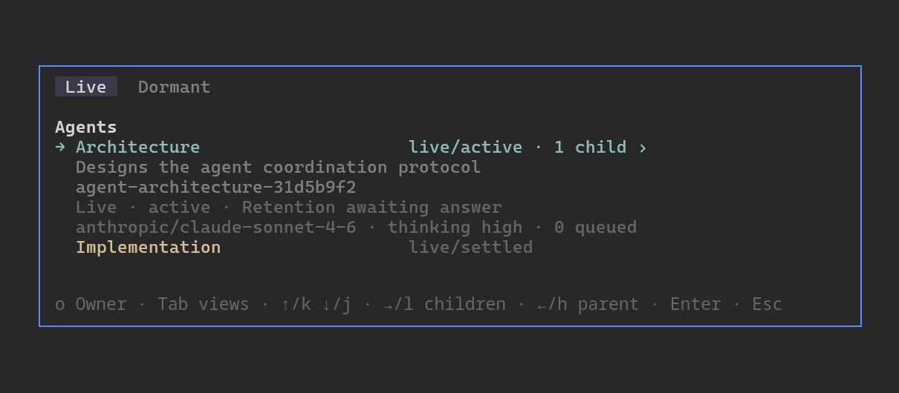

# pi-agent-coordination

Durable Pi agents that collaborate asynchronously under explicit Owner and Spawner supervision.

## Features

### Interactive Agent switching

Run `/agents` from the Owner or any Agent to open the Agent switcher. Use `/agents owner` to return directly to the exact mounted Workflow Owner presentation without opening the switcher:



Select a subagent to enter its complete Pi session and interact with it directly—read its transcript, type into its editor, or use its commands and tools.

### Coordination and supervision

- **Owner-directed Workflows:** the current interactive Pi session becomes the durable Workflow Owner. The Owner can fork or clone copied conversation into a fresh, independent Workflow.
- **Durable child Agents:** ordinary Agents can create configurable context-isolated children or cache-affine conversation forks with `agent_spawn`.
- **Messaging and Requests:** `agent_message` supports immutable Deferred and Steer Messages, one active incoming Request per Agent, automatically correlated Answers, retrieval, and cancellation. `agent_wait` joins every outstanding outbound Request Answer without consuming Workflow execution capacity when one next decision needs the complete set.
- **Human decisions for spawned Agents:** `ask_user_question` lets a spawned Agent block its exact Run on one free-form Human Answer. The full request stays in the Agent transcript, while background requests appear as passive `DECIDE` attention.
- **Run supervision:** Workflow Owners and Direct Spawners can inspect authorized Agents with `agent_observe`, then interrupt, explicitly resume, or terminate exact Runs with `agent_control`.
- **Operational incident handling:** one bounded runtime reminder recovers simple forgotten Answers before isolated Moderators handle persistent Obligation Stalls, overdue answer obligations, answer-obligated Run Failures, closed live Dependency Deadlocks, and stalled deliveries blocking upstream obligations. Review renewal, Run control, Owner escalation, and Resolution are policy-bounded and mechanically gated.
- **Durable recovery:** a fresh host reconstructs verified authority, standalone Moderators, and residual Request retention from complete Pi transcripts without replaying volatile work.

Coordination does not override Pi's user-configured compaction, retry, provider-retry, or transport behavior. One failed Moderator may be replaced once; a second failure creates passive, Owner-only Operational Attention.

## Installation

Install directly from the Git repository:

```bash
pi install git:github.com/ewgdg/pi-agent-coordination
```

## Usage

Start an interactive Pi TUI:

```bash
pi
```

The package adopts the current session as the Workflow Owner; no separate activation command is required. Print, JSON, and RPC modes do not activate coordination.

## Suggested agent templates

See [Agent Templates](docs/agent-spawning.md#agent-templates) for configuration details.

### `cheap-delegate`

A cost-efficient default for bounded implementation, routine execution, and targeted fact-finding.

Save as `~/.agents/agents/cheap-delegate.md`:

```markdown
---
name: cheap-delegate
useWhen: >-
  Use as a cost-efficient default delegate for tasks with clear goals and
  verifiable outcomes, such as implementation with explicit requirements or
  instructions and bounded scope, routine execution, or targeted fact-finding.
  Do not use for thorough review, open-ended investigation, high-stakes security
  or architecture work, or tasks requiring substantial ambiguity resolution.
  If its results remain inadequate after several iterations and show no obvious
  improvement, stop assigning that task to this template.
models:
  - id: openai-codex/gpt-5.6-luna
    thinking: high
---
```

### `moderator`

Use a cheaper model for incident handling. The `moderator` template is used automatically for incident handling.

Save as `~/.agents/agents/moderator.md`:

```markdown
---
name: moderator
useWhen: Use for moderation and incident response.
models:
  - id: openai-codex/gpt-5.6-luna
    thinking: high
  - id: deepseek/deepseek-v4-flash
    thinking: high
---
```

## Compatibility

Pi supplies the package's Pi peer modules. Compatibility is defined jointly by a fail-fast structural gate against the running host module world and the native behavioral conformance suite. The Pi version is diagnostic only.

Process-isolated Agent Runtimes select local IPC internally: Unix-domain sockets on Unix platforms and native named pipes on Windows. This transport choice is not user-configurable.

Maintainers can run the focused compatibility gate with:

```bash
npm run test:conformance
```

`npm test` remains the complete regression suite. During development, `npm run test:fast` runs in-memory tests with bounded parallelism, while `npm run test:process` runs real process, PTY, socket, and process-visible-model tests serially. Both runners impose per-test deadlines. On Linux, the supervisor contains the complete Node/PTY descendant tree in a dedicated cgroup so an interrupted run cannot leave hot workers behind. Run one process-heavy file without bypassing that supervision:

```bash
npm run test:process -- --file=agent-request.test.ts
```

## Trust and persistence

Coordination is a trust-based protocol, not a security boundary. Owners, Spawners, ordinary Agents, and Moderators are trusted participants acting through role-scoped tools.

Pi transcripts are the durable authority for identity, Messages, Requests, Deliveries, and committed results. Scheduling queues, Holds, live Run state, UI attention, and open Agent-view attachment are volatile: orderly shutdown closes them, while abrupt process loss can discard them without claiming durable completion.

## Documentation

- [Owner Workflow](docs/owner-workflow.md) — activation and compatibility behavior
- [Operational Incident moderation](docs/operational-incident-moderation.md) — trigger detection, bounded handling, Moderator authority, Resolution, and recovery
- [Cold host recovery](docs/cold-host-recovery.md) — transcript discovery, quarantine, dormant rosters, and residual Requests
- [Workflow Policy](docs/workflow-policy.md) — reloadable execution, delivery, and review limits
- [Agent spawning](docs/agent-spawning.md) — child creation and receipt semantics
- [Agent messaging](docs/agent-messaging.md) — delivery modes and Agent Requests
- [Human Requests](docs/human-requests.md) — transcript-native questions, Answer mode, and commitment
- [Agent selector](docs/agent-selector.md) — Live hierarchy, Dormant recency, attention, and keyboard navigation
- [Interactive Agent view acceptance](docs/agent-view-acceptance.md) — complete-mode rendering, input, transitions, isolation, and lifecycle evidence
- [Run supervision](docs/run-supervision.md) — observation, interruption, resumption, termination, and Agent-view retention
